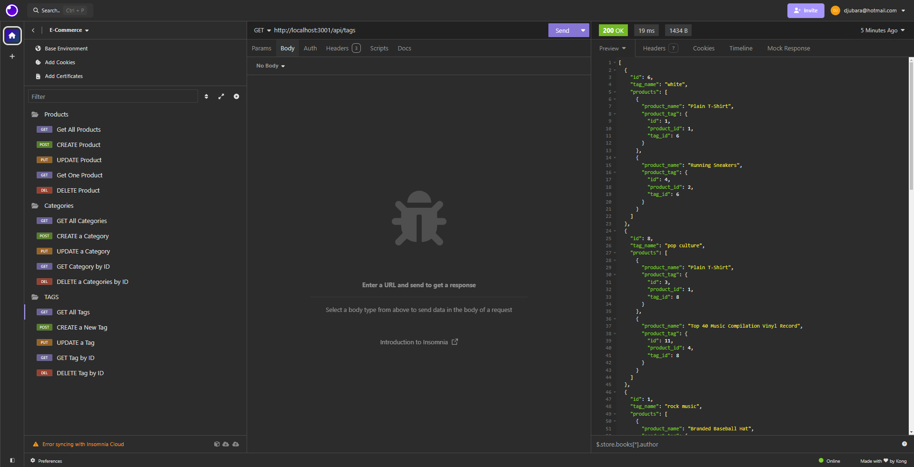

# Challenge-13-ORM-E-Commerce-Back-End-Dia-Jubara

  > 

  > ## Table of Contents

  1. [Description:](#description)
  2. [Installation:](#installation)
  3. [Usage:](#usage)
  4. [How to Contribute:](#how-to-contribute)
  5. [License Agreement:](#license-agreement)
  6. [Test Instructions:](#test-instructions)
  7. [Questions:](#questions)

  > ## Description

 A back end for an e-commerce site using Express.js API and Sequelize to interact with a PostgreSQL database.

## User Story

```md
AS A manager at an internet retail company
I WANT a back end for my e-commerce website that uses the latest technologies
SO THAT my company can compete with other e-commerce companies
```

## Acceptance Criteria

```md
GIVEN a functional Express.js API
WHEN I add my database name, PostgreSQL username, and PostgreSQL password to an environment variable file
THEN I am able to connect to a database using Sequelize
WHEN I enter schema and seed commands
THEN a development database is created and is seeded with test data
WHEN I enter the command to invoke the application
THEN my server is started and the Sequelize models are synced to the PostgreSQL database
WHEN I open API GET routes in Insomnia for categories, products, or tags
THEN the data for each of these routes is displayed in a formatted JSON
WHEN I test API POST, PUT, and DELETE routes in Insomnia
THEN I am able to successfully create, update, and delete data in my database
```

  > ## Screenshots



> ## Demo Video Link

[Video Link](https://drive.google.com/file/d/1Fd0-lB7J0sXRTcjiUnohsZTqmVQ7tINB/view?usp=drive_link)

  > ## Installation

  1. Clone Repository. GitHub repo contains application code
  2. Run `npm i`
  3. Run the application using Insomnia or Postman

  > ## Usage

 E-Commerce Back-End Application
  
  > ## How to Contribute

  Create a pull request or raise an issue.
  
  > ## License Agreement

 Subject to MIT Licensing terms and conditions.

  > ## Run the HTTP methods in Insomnia or Postman

  There are no applicable tests
  
  > ## Questions

  If you have any question please visit my GitHub at (<https://github.com/djubara>) or send an email to <djubara@hotmail.com>
